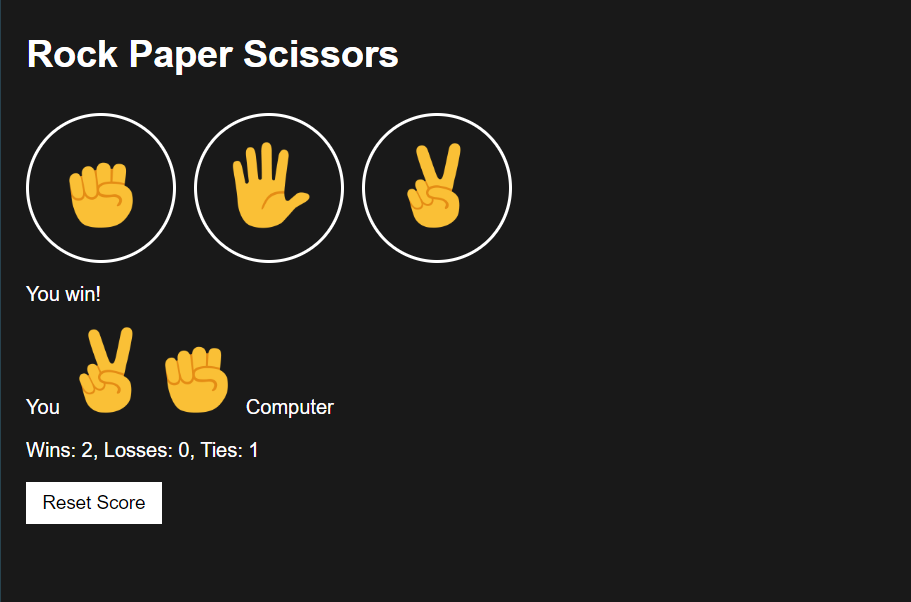

# Rock Paper Scissors Game

This project is a simple Rock Paper Scissors game implemented in JavaScript. It allows the user to play against the computer.

## Screenshot

## How to Play

1. Open the `rock-paper-scissors` folder.

2. Open the `index.html` and `script.js` file in a web browser.

3. Click on one of the buttons to make your move (Rock, Paper, or Scissors).

4. The computer will randomly select its move.

5. The result of the game will be displayed, indicating whether you won, lost, or tied.

## Code Overview

- The game logic is implemented in the `playGame` function in the `script.js` file.
- The computer's move is randomly generated using the `pickComputerMove` function.

- The result of the game is determined based on the player's move and the computer's move.
